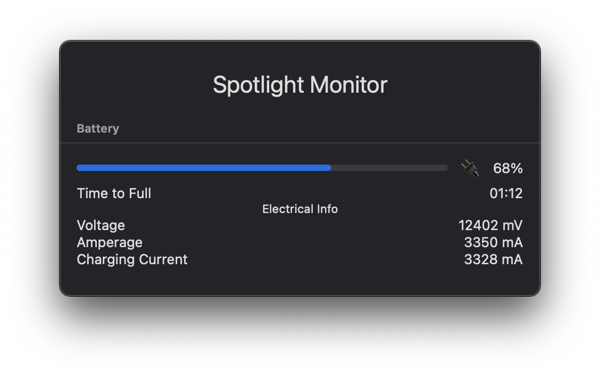

# Spotlight Monitor

Simple SwiftUI Application to show monitoring information.

Mostly built to learn ins and outs of MacOS.

## Current State

Current achieved state:

## To Do List

This is the to-do list to achieve the next state that I want:

[] Function and type documentation
[] Unit test
[] UI test
[] Listen to power / io event so battery state, capacity, etc can update dynamically and respond to changing state